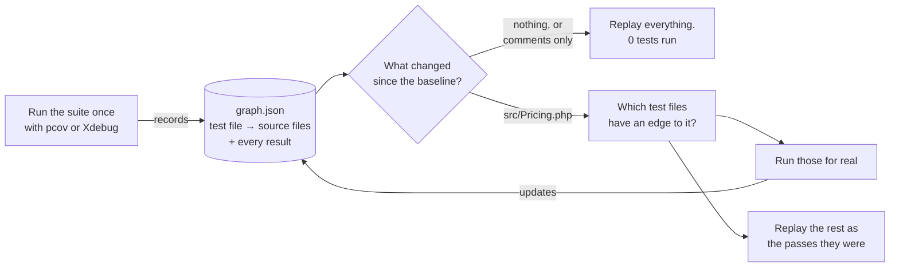
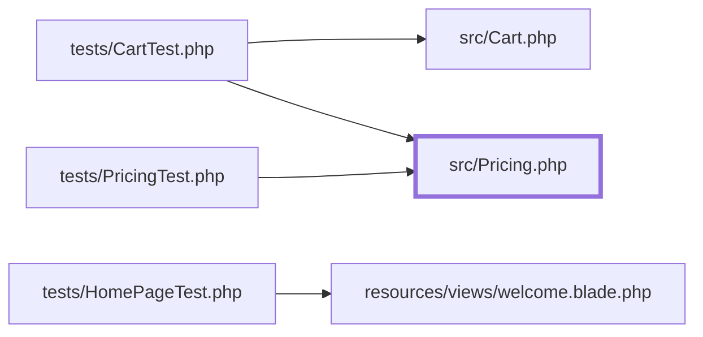
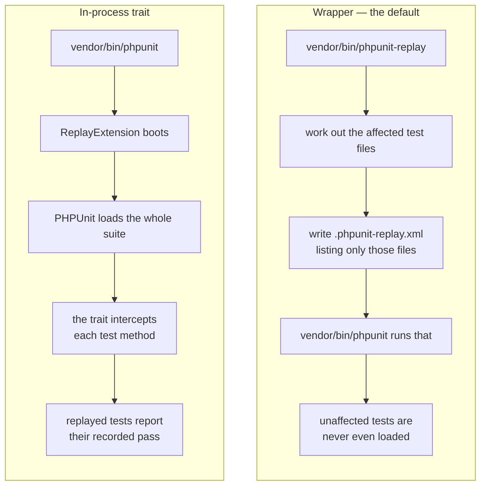
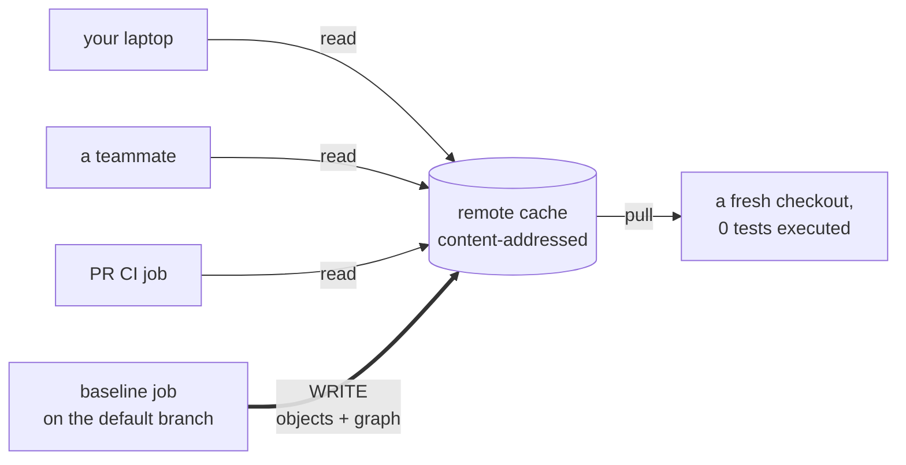
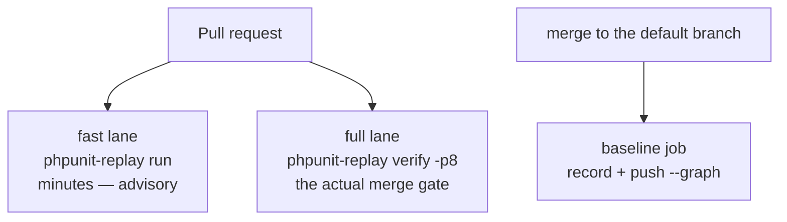

# phpunit-replay

Run only the tests your change could affect. Report the rest as the real passes they were — with their real assertion counts — instead of skipping them.

[Packagist](https://packagist.org/packages/manuglopez/phpunit-replay) · [CI](https://github.com/manuglopez/phpunit-replay/actions) · [Docs](docs/)

Plain PHPUnit 11.5, 12 or 13. PHP 8.2+. No Pest, no Laravel required.

## The problem

You edit one method. Your suite runs all 3,000 tests.

Most of those tests never call the code you touched, are never called by it, and share no runtime path with it. Nothing you did can change their result. They run anyway — every commit, every PR, every time.

So your CI bill scales with **how many tests you have**, not with **how big your change was**. And your feedback loop is minutes when it could be seconds.

Test Impact Analysis fixes this by remembering. Run the suite once and record what each test actually executed. Next time, only run the tests that touched what you changed.

## How it works



**Record.** The suite runs once with a coverage driver watching. For each test file, phpunit-replay notes which source files actually executed, and stores that as an edge: `test file → source file`. It also stores every test's own result — status, assertion count, message, duration. All of it goes in one `graph.json`.

**Select.** On a later run, it diffs your tree against the commit the graph was recorded at, plus whatever is staged, unstaged or untracked right now. Cosmetic edits get dropped first: a content hash that ignores comments and whitespace means a reformatted docblock changes nothing. What's left maps to test files through their recorded edges.

**Replay.** Every test file that wasn't selected is not re-executed. Its recorded result is served instead — as the same status it really had. That's the name: results are *replayed*, not hidden.

## What "replayed" actually means

This is the part that separates phpunit-replay from file-level TIA tools that mark unaffected tests as skipped.

| | Executed this run | Replayed | Skipped (typical TIA) |
|---|---|---|---|
| Test body ran | yes | no | no |
| Counted in the totals | yes | yes | yes |
| Carries its real assertion count | yes | yes, from the baseline | **no — lost** |
| Trips `--fail-on-skipped` | no | no | **yes, if you enable it** |
| Complete in JUnit | yes | yes, with `replayed="true"` | marked `<skipped/>` |

A skipped test is a hole in your summary. A replayed test is a fact you already established.

phpunit-replay prints one extra line below PHPUnit's own output:

```
Replay  ✓ 31 executed (31 affected, 0 uncached) · 4 replayed · 0 quarantined · baseline main@abc1234
```

| Segment | Meaning |
|---|---|
| `31 executed` | ran for real = `affected + uncached + quarantined` |
| `31 affected` | picked by a selection rule |
| `0 uncached` | new to the graph, or forced to re-run |
| `4 replayed` | served from cache as their real status |
| `0 quarantined` | content unchanged but the result flipped — always re-run |
| `baseline main@abc1234` | the branch and commit the graph was recorded against |

## Install

```bash
composer require --dev manuglopez/phpunit-replay
```

| | |
|---|---|
| PHP | ^8.2 — though PHPUnit 12 needs 8.3, and PHPUnit 13 needs 8.4.1 |
| PHPUnit | ^11.5, ^12 or ^13 |
| Git | a repo with at least one commit |
| Coverage driver | `ext-pcov`, or Xdebug with `xdebug.mode=coverage` |
| Optional | [Paratest](https://github.com/paratestphp/paratest) for `--parallel` |

You don't need to touch `php.ini`. The wrapper enables pcov per invocation with `-d pcov.enabled=1 -d pcov.directory=<root>`. With no driver at all, phpunit-replay turns itself off with a warning and PHPUnit runs exactly as it would without the package.

## Quick start

```bash
$ vendor/bin/phpunit-replay status
root:      /home/you/project
branch:    main (default: main)
head:      0742ab4
state dir: ~/.phpunit-replay/project-a8138fc79c736026
driver:    pcov (loaded, enabled per run)
framework: plain

no baseline yet
```

Record once:

```bash
$ vendor/bin/phpunit-replay record
............................S......                               35 / 35 (100%)
Tests: 35, Assertions: 61, Skipped: 1.
Replay  ● recorded 35 tests in 7 test files · 12 source files · 18 edges · graph.json 6 KB · baseline main@0742ab4 · 0s
```

Now run it with nothing changed:

```bash
$ vendor/bin/phpunit-replay
Replay  ✓ 0 executed (0 affected, 0 uncached) · 35 replayed · 0 quarantined · baseline main@0742ab4
```

About 180 ms, PHP's own bootstrap included. Now edit `src/Pricing.php` and ask what that would touch, without running anything:

```bash
$ vendor/bin/phpunit-replay --explain --dry-run
tests/CartTest.php                       ← PhpEdge  src/Pricing.php
tests/PricingTest.php                    ← PhpEdge  src/Pricing.php
Replay  2 test files would run (2 affected, 0 uncached, 0 quarantined), 33 tests would replay
```

```bash
$ vendor/bin/phpunit-replay
Replay  ✓ 6 executed (6 affected, 0 uncached) · 29 replayed · 0 quarantined · baseline main@0742ab4
```

## Which tests get picked

The graph is just edges. Here's a small one:



Edit `Pricing.php` and `CartTest` and `PricingTest` run. `HomePageTest` has no path to it, so it replays. Edit `welcome.blade.php` and only `HomePageTest` runs.

One rule is worth internalising: **a file no test ever executed affects nothing.** Docs, dead code, an unused helper — if no edge points at it, nothing runs.

### The rules, in order

Each rule consumes what earlier ones didn't claim. The Laravel ones do nothing on a non-Laravel project.

| # | Rule | Triggers on | Picks |
|---|---|---|---|
| 1 | `MigrationRule` *(Laravel)* | a changed `database/migrations/**/*.php` | tests whose recorded tables intersect the ones it touches |
| 2 | `PhpEdgeRule` | a changed or deleted file the graph knows | every test file with an edge to it |
| 3 | `TestFileRule` | a changed file that is itself a test | itself |
| 4 | `SiblingRule` *(Laravel)* | a new `.php` in a provider/listener/policy/command/factory/seeder directory | tests with an edge to a neighbour in that directory |
| 5 | `BladeRule` *(Laravel)* | a changed `.blade.php` the graph doesn't know | walks `@include`/`@extends`/`view()`/`<x-…>` up to a Blade file it does know, then that file's tests |
| 6 | `WatchRule` | everything left over | glob → test-directory patterns: built-in defaults, framework defaults when detected, plus your own `watch` config |

Two more categories always run, regardless of rules: **test files new to the graph**, and any cached result that **must be re-checked** — a failure or error always re-runs; a risky, incomplete or skipped result re-runs only if your PHPUnit config would actually surface it.

### What counts as "changed"

Two filters narrow the git diff before selection sees it:

- **Content hash.** A file whose normalized hash matches the baseline is dropped. Comment and whitespace edits to `.php` (tokenizer-based), Blade, and JS/TS/Vue/Svelte all vanish here.
- **Last-run snapshot.** A dirty file already accounted for last run is dropped again — touching the same uncommitted change twice doesn't re-run its tests. Revert it and it comes back.

### Baselines are per branch

A branch with no baseline of its own walks an ordered candidate list (`baseline_branches`, or `default_branch` as shorthand), keeps only candidates whose recorded commit is an ancestor of `HEAD`, and picks whichever is fewest files away from your tree.

That's what git-flow teams want: a feature branch cut from `develop` inherits `develop`'s recording, a hotfix cut from `main` inherits `main`'s. `status` and `--explain` tell you which one was chosen.

A **fingerprint** guards against baselines that can't apply. Change `composer.lock`, `phpunit.xml` or `phpunit-replay.php` and the whole graph is discarded — a fresh recording follows. Change PHP's minor version, the coverage driver or the OS family and the edges survive but the cached results don't, because those can't be trusted across that boundary.

## Two ways to run it



### The wrapper — zero changes to your tests

`vendor/bin/phpunit-replay` writes `.phpunit-replay.xml` next to your real config: your `phpunit.xml` verbatim, except `<testsuites>` becomes a single suite listing only the files that must run. Everything else — `<source>`, `<php>`, `<extensions>`, bootstrap — is kept. PHPUnit runs against that, then the file is deleted.

Add `.phpunit-replay.xml` to your `.gitignore`.

Pass a PHPUnit selection option yourself — `--filter`, `--group`, `--testsuite`, a path — and selection steps aside for that run. You get exactly what you asked for.

### The in-process trait — when PHPUnit must see everything

For an IDE that launches `phpunit` directly, or `--coverage-html`, or just not wanting a wrapper in the loop.

```php
abstract class TestCase extends \PHPUnit\Framework\TestCase
{
    use \Manuglopez\Replay\PHPUnit\Replayable;

    protected function setUp(): void
    {
        parent::setUp();

        if ($this->isReplaying()) {
            return; // optional: skip expensive boot work too
        }

        // ...boot the app, RefreshDatabase, etc.
    }
}
```

```xml
<extensions>
    <bootstrap class="Manuglopez\Replay\PHPUnit\ReplayExtension">
        <parameter name="mode" value="auto"/> <!-- auto|record|replay|off -->
    </bootstrap>
</extensions>
```

`setUp()` always runs, for every test. Only what you guard behind `isReplaying()` is skipped — the trait hooks the test method, never `setUp()`.

### Never replayed, in either mode

- a `#[Depends]` provider — its dependents would get `null`
- a cached failure or error — always re-runs
- a test the graph doesn't know — it's new
- `#[NotCacheable]`, or a `never_cache` glob match
- a quarantined test

## Commands

`run` is the default, so `vendor/bin/phpunit-replay` and `… run` are the same. Anything after `--`, or the first token it doesn't recognise, is forwarded to `phpunit` untouched.

| Command | What it does |
|---|---|
| `run` *(default)* | Runs what's affected, replays the rest. `--fresh` `--no-remote` `--explain` `--dry-run` `--log-junit=FILE` `--allow-ci-baseline` `--parallel`/`-p[=N]` |
| `record` | Runs the whole suite and records a fresh baseline. What CI runs after a merge. `--fresh` `--parallel` |
| `verify` | Runs the whole suite *and* checks every result against what the cache holds. Your merge gate. `--parallel` |
| `status` | What's currently stored: branch, driver, counts, drift, quarantine, remote, lifetime divergences |
| `explain <path>` | Which test files a change to `<path>` would affect, and why. Runs nothing |
| `prune` | Drops stale state. `--flaky` `--branches` `--all` `--remote --keep-months=N` `--squash` |
| `push` / `pull` | Publish to, or fetch from, the configured remote. `push --graph` also publishes the branch baseline |
| `baseline-path` | Prints the state directory and nothing else, for CI to archive |

Full option reference: **[docs/configuration.md](docs/configuration.md)**.

## Configuration

Everything is optional. An empty project works with no config file at all. Create `phpunit-replay.php` at your root when you want to override something:

```php
<?php

return [
    'remote' => null,             // 'file:///mnt/cache' | 'https://…' | 'git@github.com:org/project-replay.git'
    'remote_push' => 'objects',   // 'objects' = your own results | 'all' = also baselines (CI) | 'off'
    'default_branch' => null,     // null = autodetect
    'baseline_branches' => [],    // ordered candidates for git-flow, e.g. ['develop', 'master']
    'watch' => [],                // extra glob => test directory mappings
    'never_cache' => [],          // test files that always run for real
];
```

Environment variables always win over the file. The three you'll actually use:

| Variable | Effect |
|---|---|
| `PHPUNIT_REPLAY=0` | Turns the package off completely, extension registered or not |
| `PHPUNIT_REPLAY_DEBUG=1` | Prints every selection decision to stderr |
| `PHPUNIT_REPLAY_STATE_DIR` | Overrides where state is stored |

All keys and all variables: **[docs/configuration.md](docs/configuration.md)**.

## Keeping the cache honest

Serving a wrong result would be worse than caching nothing, so there are three ways to opt a test out and one that happens by itself:

1. **`#[NotCacheable(reason: '…')]`** on a class or method. Read while recording, stored in the graph. Always runs for real.
2. **`never_cache` globs** — for `tests/Browser/**`, or anything hitting a real external service.
3. **Automatic quarantine.** A test whose content is unchanged but whose result *class* flipped (pass↔fail) is recorded in `flaky.json` and forced to run every pass, until `prune --flaky` or `quarantine_release_after` consecutive stable passes. A cached failure healing into a pass is not a flip — that's the normal path.
4. **`verify`** measures the whole thing. It runs the full suite in record mode and compares every result against the cache:

```
Verify  ✓ 1240 tests · 1198 would replay · 0 divergences · 0 unverified (lifetime: 2 in 143 runs)
```

- **`1240 tests`** — executed for real this pass.
- **`1198 would replay`** — how many a `run` on this same tree would have served from cache. Decided by the same code `run` uses, against the state before the pass started, so it describes the tree, not the pass.
- **`0 divergences`** — results whose class differs from the cached one at the same content key. **This is the number that has to stay at zero.**
- **`0 unverified`** — `would replay` tests this pass couldn't check, because it saw a different dependency set than the cached result was recorded against. Settles to 0 as the graph stops moving.

`status` shows the current quarantine and the lifetime divergence count — the figure to watch before trusting a fast lane as a gate on its own.

## Sharing the cache with your team

By default every machine keeps its own `graph.json` and re-records from scratch the first time it sees a commit. Point them all at a **remote** and that work is inherited instead of repeated.



The address of a result is a hash of what went into producing it, so two machines that share inputs share results, and nobody can overwrite anybody.

### Who is allowed to write

`remote_push` decides this, and it has three settings, not two:

| `remote_push` | publishes its own results | publishes the branch baseline (`graph/**`) | for |
|---|---|---|---|
| `off` | no | no | **developers and PR jobs, when the cache is write-restricted** |
| `objects` *(the current default)* | yes | no | developers, when everyone may write results |
| `all` | yes | yes | the one CI job that owns the branch baseline |

**The recommended setup is the one drawn above: only CI writes.** Give the cache a write credential that lives solely in CI — a deploy key on a git backend, a scoped token on HTTP — leave the whole team on read access, and set:

```php
'remote_push' => getenv('CI') ? 'all' : 'off',
```

That way a developer's machine reads the cache and never tries to publish to it. Nothing is lost by it: what a laptop would have published, CI republishes on the next baseline run anyway.

Note the default is `objects`, **not** `off`. It is safe — a result's address is a hash of its inputs, so concurrent writers of the same key are a no-op rather than a conflict — but it does mean that out of the box, a developer's machine publishes its own results. If your cache is read-only for the team and you leave the default in place, every developer run will attempt a push it isn't allowed to make and print a warning. The run still succeeds; the warning is the only symptom, and `remote_push: 'off'` is the fix.

Only `all` ever writes `graph/**`, the branch baseline everyone else's cold start reads. Keep that on one job.

| | Local only | Shared folder | HTTP (S3/MinIO) | Dedicated git repo | CI artifacts |
|---|---|---|---|---|---|
| Needs | nothing | a mounted path | an endpoint with GET/PUT/HEAD | an empty repo + a deploy key | nothing, on GitHub |
| Good for | solo work, evaluating | one office or VPN | teams already on object storage | teams with git and nothing else | GitHub-only, zero infra |

An unreachable, unauthorised or misconfigured remote is always a warning on stderr and a local-only pass. It can never break a test run.

Setup for each backend, plus troubleshooting: **[docs/sharing-the-cache.md](docs/sharing-the-cache.md)**.

## CI in two lanes



Keep the full suite as your gate. `verify` does that *and* checks the cache at the same time, which is what keeps the baseline trustworthy. It's the slowest command here, so give it `--parallel`: on a real 9,000-test suite that took it from ~40 minutes to 5m19s without changing what it checks.

The fast `run` lane is for quick feedback, not for merging — at least until your lifetime divergence count has earned it.

You'll need: a checkout deep enough that the baseline commit is an ancestor of `HEAD` (`fetch-depth: 0`), pcov or Xdebug on the runner, and a configured remote so state survives between jobs.

Working examples for all three jobs plus a monthly GC job: **[.github/workflows/examples/](.github/workflows/examples/)**.

## Laravel

Enabled when `artisan` exists, unless you set `laravel` to `off`. There's no `illuminate/*` dependency — Laravel is reached through `class_exists()`, string class names and duck-typed calls.

Three extra things get tracked while recording:

- **Tables.** A query listener links every table a test's queries touch.
- **Blade views.** A view composer on `'*'` links every rendered view as a dependency, exactly like a PHP file.
- **Migration-aware tests.** Any test file using `RefreshDatabase`, `DatabaseMigrations` or `DatabaseTransactions` is widened to cover every table any migration creates. Conservative on purpose.

The package's own `laravel-lite` fixture shows the effect:

| Change | Result |
|---|---|
| Add a column to the `comments` migration | `3 executed · 1 replayed` — every test using `RefreshDatabase`. `HomePageTest` never touches the database, so it replays |
| Edit `welcome.blade.php` | `1 executed · 3 replayed` — only the test that renders it |

`--parallel` on Laravel also wires up per-worker database isolation automatically, whenever Laravel, Paratest and a resolvable `ParallelRunner` are all present. Without it every worker migrates the same database, which shows up as deadlocks rather than clean failures.

## Parallel

```bash
phpunit-replay --parallel        # Paratest's own process count
phpunit-replay -p 4             # 4 workers
phpunit-replay record -p 4      # a full parallel recording
phpunit-replay verify -p 8      # the merge gate, in parallel
```

Ask for `--parallel` without Paratest installed and you get a warning and a sequential run, not a failure. Each worker writes its own partial; they're merged before the graph is updated — edges by union, results last-write-wins — so the summary is the same whatever the process count.

## Coverage reports

Pass `--coverage-php=FILE` through as usual. When a test file is recorded with coverage active, its own coverage slice is stored too. On a later pass, PHPUnit's coverage from whatever really ran is merged with the stored slices of everything that replayed, so the report covers the whole suite:

```
Lines: 97.59% (81/83)          # 0 tests executed — this came entirely from snapshots
```

A snapshot only exists for a test file recorded *with* `--coverage-php` active. Anything else simply contributes nothing, the same as if it had never run.

## Comparison

Being specific about what each tool does, rather than what it aims to do. The Pest and `jasonmccreary` columns were re-checked against their own docs and repository on **2026-09-09**; the `gosuperscript` column is from an earlier survey and has not been re-verified.

| | [Pest 5 Tia](https://pestphp.com/docs/tia) | [jasonmccreary/phpunit-tia](https://github.com/jasonmccreary/phpunit-tia) | [gosuperscript/phpunit-tia](https://github.com/gosuperscript/phpunit-tia) | phpunit-replay |
|---|---|---|---|---|
| Runner | Pest | PHPUnit 13 | PHPUnit | PHPUnit 11.5, 12, 13 |
| PHP required | 8.4 | 8.4 | — | **8.2** |
| Unaffected tests | replayed, with real coverage | **skipped (`S`)** | **skipped** | replayed as their real status |
| Complete summary and JUnit | yes | no — assertion counts lost | no | yes |
| Cosmetic edits ignored | yes | partial | partial | yes, tokenizer-based |
| Per-branch baselines | yes | `fallback-branch` | no | yes, plus nearest-baseline for git-flow |
| Remote cache | GitHub Actions artifact, needs `gh`, GitHub only | none | none | content-addressed: filesystem, HTTP/S3/MinIO, or a git repo |
| Non-hermetic tests | no detection | no detection | no detection | `#[NotCacheable]`, `never_cache`, automatic quarantine, `verify` |
| Graph reproducibility | not addressed | not addressed | not addressed | [measured and largely fixed](docs/reproducibility.md) |

Two things worth saying plainly.

**Pest's Tia engine is where this came from.** Roughly 60% of its framework-agnostic core was ported here by copy under its MIT license — see [Attribution](#attribution). `jasonmccreary/phpunit-tia` describes itself as a port of the same engine. There are two independent ports of Pest's engine to plain PHPUnit, and this is one of them.

**The difference that matters most is what happens to an unaffected test.** In both `phpunit-tia` packages it's reported as *skipped* — its assertion count is gone, and `--fail-on-skipped` can turn it into a build failure. Here it either never enters the run (wrapper) or reports the exact result it produced last time (in-process). No code from either `phpunit-tia` package was used.

## Where this sits

Selecting and caching tests by recorded dependency is an old idea. Most ecosystems have a version of it:

| Ecosystem | Approach |
|---|---|
| [Go's `go test`](https://go.dev/doc/go1.10#test) | Result cache keyed by a hash of the binary and its inputs; a hit prints `(cached)` |
| [Bazel](https://bazel.build/remote/caching) / [Buck2](https://buck2.build/) | Declared graph plus a remote action cache keyed by action inputs |
| [Nx](https://nx.dev/concepts/how-caching-works) / [Turborepo](https://turbo.build/repo/docs/crafting-your-repository/caching) | Task input hashing with a shareable remote cache |
| [Jest `--onlyChanged`](https://jestjs.io/docs/cli#--onlychanged) / [Vitest](https://vitest.dev/guide/cli.html) | Static import-graph analysis from git's changed files |
| [pytest-testmon](https://github.com/tarpas/pytest-testmon) | Coverage-based, at line/block granularity |
| [Ekstazi](http://ekstazi.org/) | Regression test selection for Java, via recorded class-level dependencies |
| [Datadog Intelligent Test Runner](https://docs.datadoghq.com/tests/intelligent_test_runner/) | Coverage-based, skips tests unaffected by the diff |
| [Gradle Predictive Test Selection](https://docs.gradle.com/enterprise/predictive-test-selection/) / [Launchable](https://www.launchableinc.com/) | ML-ranked selection from historical failure data |

phpunit-replay sits closest to **testmon** and **Ekstazi**: coverage-based selection from a recorded graph, not a static import guess. Its content-addressed sharing is Go's and Bazel's idea — a result keyed by what produced it, reusable anywhere. Its replay-as-pass is the PHPUnit analogue of Go's `(cached)`. Its two-lane CI advice is Gradle's own. Where it's deliberately coarser than testmon is granularity: file-level, not block-level.

## Known limitations

- **Edges are file-level.** Any change to a source file re-runs every test file with an edge to it, even if you touched an unrelated function.
- **In-process mode still runs `setUp()`** for every test. Only what's behind `isReplaying()` is skipped.
- **`#[Depends]` providers always execute**, in both modes.
- **Non-hermetic tests need a marker.** The package cannot tell on its own that a result depends on the clock or an external API. Mark it, glob it, or let quarantine catch it after the first flip.
- **The HTTP backend has no listing endpoint**, so `prune --remote` needs the filesystem or git backend.
- **Coverage snapshots only exist** for test files recorded with `--coverage-php` active.
- **A rebase invalidates a commit-based baseline** and forces a fresh recording — but content-addressed replay still works, so a test file whose content is unchanged replays anyway.
- **Graph attribution is order-dependent at the margin.** Which test gets credited for a file that only executes once per process depends on run shape. Measured, mostly fixed, and the residual is a cache miss rather than a wrong answer — the full measurement is in [docs/reproducibility.md](docs/reproducibility.md).

## Trying it on your project

1. To test a local checkout instead of a release: `composer config repositories.replay path ../phpunit-replay && composer require --dev manuglopez/phpunit-replay:@dev`.
2. `vendor/bin/phpunit-replay status` — should say there's no baseline yet, and show your driver, root, branch and framework.
3. `vendor/bin/phpunit-replay record` — the whole suite once, ending with the recording summary.
4. Run `vendor/bin/phpunit-replay` again with nothing changed: 0 executed, everything replayed, under two seconds.
5. Touch one class, then `vendor/bin/phpunit-replay --explain` — it lists what's affected and why, without running anything.
6. `vendor/bin/phpunit-replay verify` — the whole suite again, reporting how much the fast lane would have covered and how much of it would have been wrong. Run it twice: with nothing changed, `would replay` is identical both times.
7. If something looks off: `--fresh` forces a clean recording, `status` shows what's stored, and `PHPUNIT_REPLAY_DEBUG=1` prints every selection decision to stderr.

## Attribution

Portions of this package are derived from [Pest](https://github.com/pestphp/pest) (© Nuno Maduro, MIT) — specifically the framework-agnostic parts of its Test Impact Analysis engine. The full original license is in [`LICENSE-PEST.md`](LICENSE-PEST.md), and every ported file carries an `@see` docblock pointing at its exact origin. This project is not affiliated with, endorsed by, or officially connected to Pest or its authors.

## License

MIT. See [`LICENSE`](LICENSE). © Manuel González.
